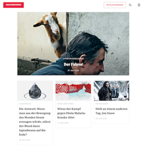
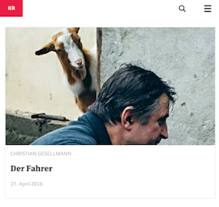
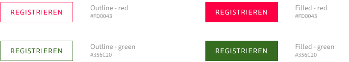
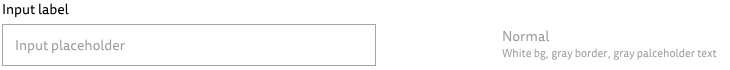
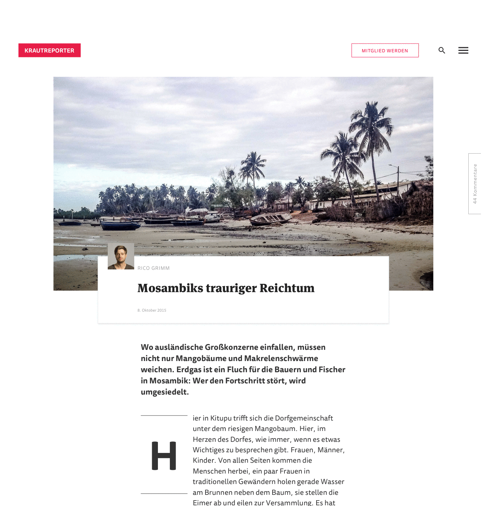

# Initiating frontend development

## Overview
Bitcrowd is not a design agency. As such, we rely on designs from you, the client, and we will use those as our starting point for building a product.

We would prefer to work closely with you. We want to have a discussion. We want to know why design decisions have been made. By understanding your decisions we can build a better product. We want to learn about your product, how you made your decisions about how the site should look.

In return, we want to inform you of the possibilities, limitations and tradeoffs of web technology.

## What we need from you
We need *complete* designs. We can't start work with only the design for a logo, or only the design for your frontpage. We need to know the complete visual story of your site.

A complete design would include what all layout pages will look like on various devices, such as a phone, tablet and laptop (we build our products mobile-first and for all devices).

We recommend having your designs commissioned *after* content has been written. Content influences design.

### 1. Layout pages
A layout page is one of the different "types" of page that make up your site. The different types will depend upon your organisation and the type of website that you wish to produce.

But for example, a magazine website might have:
* A front page layout
* An article page layout
* A utility page (About us, Impressum, Contact details) layout

There might be thousands of article pages, but only one article layout page. Conversley, there is only one front page, but there will still need to be a front page layout.

As another example, a shop website might have:
* A front page layout
* A product page layout
* A collections page layout
* A utility page layout

Again, there might be thousands of individual product pages, but only one product layout page. Think of a layout page as a prime example, or as a template.

#### Example
Here are a couple of examples of a frontpage layout for a magazine project (click on the images for a more detailed view). Notice that both the mobile and the desktop versions have been provided.

 

#### Checklist
What you'll need to supply us with:
* [ ] Desktop version of each layout page
* [ ] Tablet version of each layout page
* [ ] Mobile version of each layout page

### 2. Page components
Take a look at "Component-based design" below for more details about components.

Layout pages are populated by components. A component might be a button, or a paragraph of text. A single component type might have many variations. For example, a button might have many colors, or an icon might have several sizes.

If you are not able to supply component-level designs, we will take the time to extract the relevant components from your layout designs.

#### Examples
An example of a supplied button component, showing all the variants that it might be used in (click on the image for a more detailed view):

#### Checklist
If you are supplying component-level designs you'll need to supply us with:
* [ ] A mockup of each component, in each of its variant formats.

### 3. Interaction states
A component is considered interactive if it changes appearance when a user interacts with it, by hovering with their mouse pointer, or tapping with a finger.

Common components such as text links, buttons, input fields are normally interactive by default.

We will need examples of how interactive components look when in use.
* For example, what does a button look like when it it clicked? When it is hovered over?
* What does an expandable element look like when it is expanded?
* What does an input field look like when it is focussed?

We do not need entire layout pages and breakpoints repeating. We just need to see that components interaction states.

#### Examples
Here's a great example of interaction states for a button (click on the image for a more detailed view):

And the interaction states for an input field (click on the image for a more detailed view):

#### Checklist
Even if you're not supplying us with component-designs, we will still need to see interaction states for common interactive elements, such as buttons and input fields.
* [ ] An interaction state design for each interactive component.

### 4. Ancillary items
If you use or require a custom font for use on your site, you must make arrangements for purchase of an appropriately-licensed font. You will then need to supply a copy of this font for us to use. This will need to be done before we can even view your static designs, as Sketch and Photoshop files will require a copy of the appropriate font to be sitting on our computers.

If you have any custom icons that you wish to use on your site, these will need to be supplied in the Sketch/Photoshop files, or as separate SVG files.

#### Checklist
* [ ] Fonts - If you've licensed this from a reputable font supplier, they will supply multiple formats of the same font. Please send them all to us, as we'll need them for the various web browsers.
* [ ] Icons - Ensure you've given us a copy of all icons used in your designs. This will include your company logo, hamburger icons, icons for Twitter, Facebook, etc.

## How we will use what you give us
* We will work with you to divide up your static page type designs into the appropriate basic components.
* If you've got a design already going using component-based design, then that's fantastic - we can probably take your work and utilise it immediately.
* If not, we will take the time to divide your designs up into components.

### What is component-based design
* So what is component-based design?
* Components are the fundamental units of your site.
* A basic component might be something like:
  * A button
  * A header
  * An icon
  * An image with caption
  * A video
  * A form input
  * An information card
* Identifying repeating areas of design and turning them into components helps us work faster.
* Components are reusable and are easily expanded to multiple variations.
* Utilising components helps us to bridge the gap between design and code.

### Why do we use component-base design?
* Component-based design leads to cohesive, consistent experiences.
* Component-based design speed up a project's workflow.
* Centralizing UI components in a pattern library establishes a shared vocabulary for everyone working on a project.
* Component-based design makes cross-browser/device, performance, and accessibility testing easier.
* Once component-based design (with an accompanying pattern library) is established, it serves as a future-friendly foundation for the organization to modify, tweak, extend, and improve upon over time.

### Extracting components from a static design
The following animation shows, at a very simple level, all the components that might be extracted from a typical page.

### Working with components
* Once you have supplied component-designs, or we have reworked your static designs into components, we will build a pattern library that will demonstrate how each component will work.
* You will be able to identify how the static designs might work in real life. We can also identify any unforeseen problems or design obstacles at this stage.
* We will work with you to make sure that the living components work the way that you wish.
* We will then use these components to build up a mobile-first layout page and we will create working prototypes from your components.

## Next steps
We hope you've found this guide useful. If you have any questions about your project, or suggestions as to how we might improve this guide, please get in touch.
